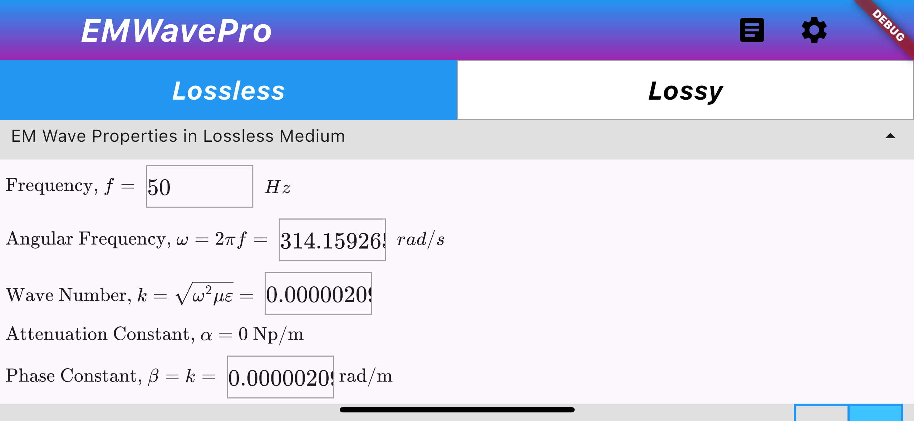
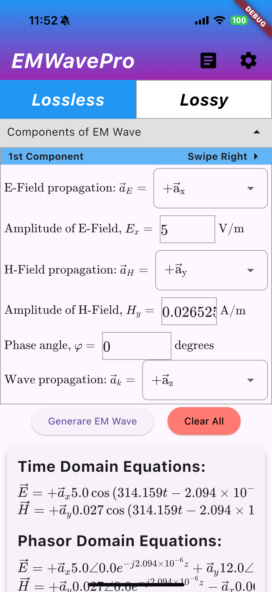
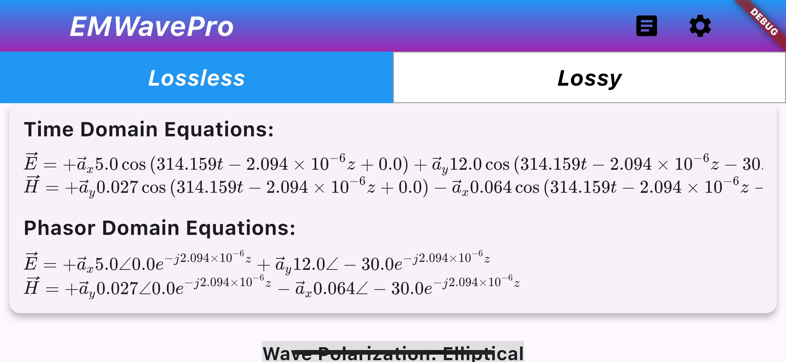
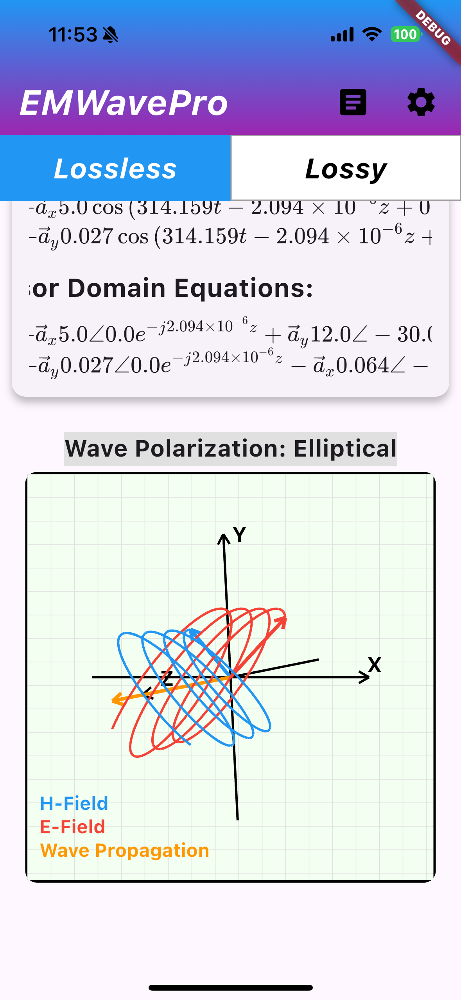
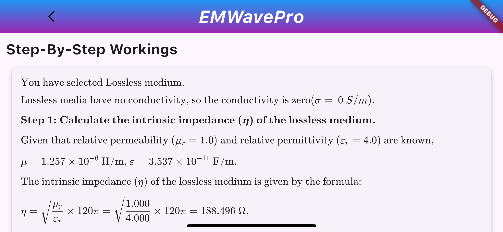

# EMWavePro 🚀  
*A Flutter-based app for electromagnetic plane wave analysis*

## 📌 Background Information of this Project
I a student from Nanyang Technological University (NTU), completed this final year project
in partial fulfilment of the requirements for the Degree of Bachelor of Engineering in the
year 2025.

## 📌 Inital Setup
The EMWavePro application is developed using Flutter and is currently optimized for iOS devices. To run this application, please ensure that you have Xcode installed on your Mac, along with the necessary developer rights configured in Xcode to successfully build and run the application.

For Android developers, you can attempt to build an Android App Bundle and test the EMWavePro application; however, please note that I cannot guarantee its functionality at this time.

## 📌 Overview
EMWavePro is an interactive Flutter application designed to help students and engineers analyze 
electromagnetic (EM) plane waves. The app allows users to input various parameters to visualize 
electric and magnetic field wave propagation in real-time.

## 📌 Installation
1. **Clone the repository**  
   ```bash
   git clone https://github.com/mkabilan24/emwavepro.git
   cd emwavepro

2. **Install Dependencies**
   ```bash
    flutter pub get

4. **Run the application**
   ```bash
    flutter run

## 📌 Images










## 📌 Updates

| No. | Bug Fixes / Updates   | Details                                                           | Date Fixed  |
|-----|-----------------------|-------------------------------------------------------------------|-------------|
| 1   | Math Field \Box Error | Error led to red screen when switching from Lossless to Lossy tab | 05 May 2025 |
| 2   | Exponential Decay     | Added Exponential Decay for Lossy Medium Wave Propagation. The decay constant is set at -0.03, 
as the graph is not drawn to scale and for better view.  | 06 May 2025 |
| 3   | Presets               | Preset buttons are added to allow users to try default/random values | 07 May 2025|

Updated: 07 May 2025